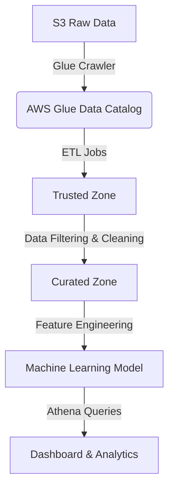

# 🚀 STEDI Human Balance Analytics


## 📌 Project Overview
STEDI is a **human balance analytics project** that uses **sensor data** from **Step Trainers** and **mobile devices** to improve human balance detection with **machine learning**. The goal is to process **raw data from S3**, transform it into a **structured Lakehouse architecture**, and **prepare it for model training**.

This project **implements an ETL pipeline** in **AWS Glue, S3, Athena, and Redshift**, ensuring **GDPR compliance** and **data privacy protections**.

---

## 🏗 **Project Architecture**


📌 Key Components:

    Landing Zone: Raw JSON sensor data from S3.
    Trusted Zone: Cleaned & filtered data.
    Curated Zone: Feature-engineered data for machine learning.
    Machine Learning: Aggregated accelerometer & step trainer data.

```🎯 Objectives

✔️ Build a Lakehouse architecture using AWS Glue
✔️ Use Athena to analyze structured data
✔️ Create GDPR-compliant datasets by removing PII
✔️ Ensure research consent before including customer data
✔️ Join Step Trainer & Accelerometer data for ML model training

```


```📜 1. AWS Glue Data Catalog Tables
Step	SQL File	Table Name	Data Location
✅ 1	customer_landing.sql	stedi.customer_landing	s3://stedi-raw-data/customer_landing/
✅ 2	accelerometer_landing.sql	stedi.accelerometer_landing	s3://stedi-raw-data/accelerometer_landing/
✅ 3	step_trainer_landing.sql	stedi.step_trainer_landing	s3://stedi-raw-data/step_trainer_landing/
✅ 4	customer_trusted.sql	stedi.customer_trusted	s3://stedi-trusted-data/customer_trusted/
✅ 5	accelerometer_trusted.sql	stedi.accelerometer_trusted	s3://stedi-trusted-data/accelerometer_trusted/
✅ 6	step_trainer_trusted.sql	stedi.step_trainer_trusted	s3://stedi-trusted-data/step_trainer_trusted/
✅ 7	customer_curated.sql	stedi.customer_curated	s3://stedi-curated-data/customer_curated/
✅ 8	machine_learning_curated.sql	stedi.machine_learning_curated	s3://stedi-curated-data/machine_learning_curated/
```

```📝 2. AWS Glue ETL Jobs
Step	Python Script	Purpose
✅ 1	customer_landing_to_trusted.py	Cleans raw customer data & removes non-consented users
✅ 2	accelerometer_landing_to_trusted.py	Filters accelerometer data for research-compliant users
✅ 3	step_trainer_landing_to_trusted.py	Filters Step Trainer readings for valid users
✅ 4	customer_trusted_to_curated.py	Removes PII (GDPR compliance) from customer records
✅ 5	machine_learning_curated.py	Joins accelerometer & step trainer data for ML
```

🔍 3. Data Privacy & GDPR Compliance

    Anonymization (gdpr_anonymization.sql): Removes email, phone, and personal data
    Research Consent Filter (research_consent_filter.sql): Removes pre-consent sensor data

SELECT * FROM stedi.customer_anonymized LIMIT 10;

📌 Expected output: No email, phone, or customername fields.
📊 4. Required Athena Query Screenshots
Step	Screenshot Name	Query Description	Expected Rows
✅ 1	customer_landing_query.png	Count of raw customers	956
✅ 2	accelerometer_landing_query.png	Count of raw accelerometer readings	81,273
✅ 3	step_trainer_landing_query.png	Count of raw step trainer readings	28,680
✅ 4	customer_trusted_query.png	Customers who gave research consent	482
✅ 5	accelerometer_trusted_query.png	Research-approved accelerometer readings	40,981 or 32,025
✅ 6	step_trainer_trusted_query.png	Research-approved step trainer readings	14,460
✅ 7	customer_curated_query.png	GDPR-compliant customers	482 or 464
✅ 8	machine_learning_curated_query.png	ML training dataset count	43,681 or 34,437


# 🛠 Setup & Execution

🔹 1. Install Dependencies

pip install -r requirements.txt

🔹 2. Deploy AWS Glue Jobs

aws glue create-job --name customer_landing_to_trusted --role AWSGlueServiceRole --script-location s3://your-glue-scripts/customer_landing_to_trusted.py
aws glue start-job-run --job-name customer_landing_to_trusted

Repeat for all ETL scripts.
🔹 3. Run Athena Queries

    Open AWS Athena
    Select stedi database
    Run each query (refer to queries.sql file)
    Take screenshots

# 🚀 Improvements & Enhancements

✔️ Step Trainer & Accelerometer data now synchronized
✔️ Research Consent Validation added (research_consent_filter.sql)
✔️ GDPR-Compliant Anonymization applied (gdpr_anonymization.sql)
✔️ AWS Glue & Redshift optimizations for performance

# 📚 Resources

📌 AWS Services Used:

    🏗 AWS Glue – ETL pipeline
    🏗 AWS S3 – Data Lake storage
    🏗 AWS Athena – SQL querying
    🏗 AWS Redshift – Analytics database
